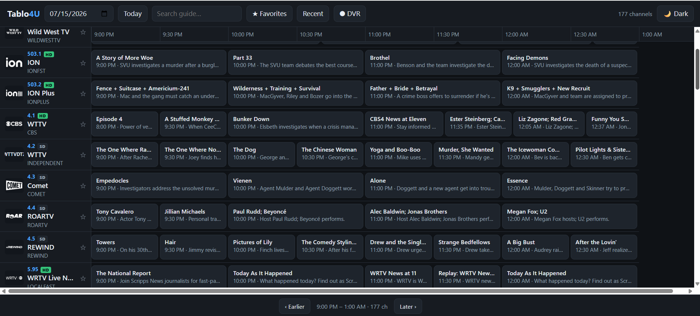
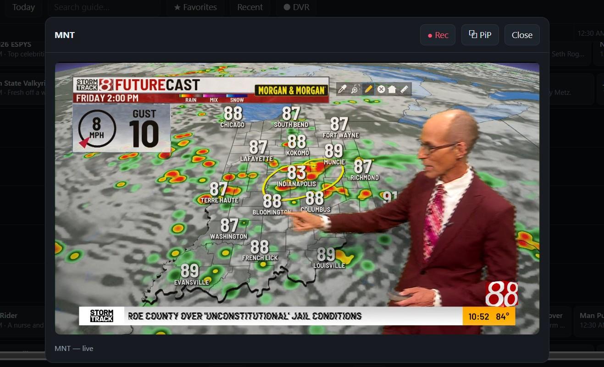
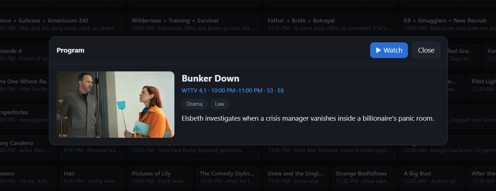

# Tablo4U

**Watch your Tablo in any browser — no Plex required.**

> 💡 **Tablo4U was the idea of [HearHellacopters](https://github.com/hearhellacopters),
> the author of [tablo2plex](https://github.com/hearhellacopters/tablo2plex)** —
> a native web front-end for Tablo 4th Gen, built on the same reverse-engineered
> API work. This project exists thanks to that idea and the API groundwork from
> tablo2plex.

Tablo4U is a self-hosted web app that talks to a **Tablo 4th Gen** device using
Tablo's *own JSON API*. It gives you a real channel guide and an in-browser
live player, with multi-user logins — so you can watch OTA (and OTT) TV from a
laptop, phone, or TV browser without being locked into the official apps.

> **Companion to [tablo2plex](https://github.com/hearhellacopters/tablo2plex).**
> Where tablo2plex bridges Tablo → Plex (spoofing an HDHomeRun and converting
> the guide to XMLTV), Tablo4U skips all the translation and exposes Tablo
> **directly** as a web app. Same reverse-engineered auth, native data.







---

## Features

- 📺 **Native EPG guide** — a rolling timeline grid (~1h back to ~3h ahead with
  Earlier/Later navigation, live now-line, live indicators, date picker,
  **channel logos**, **HD/SD badges**, and **lazy-loaded rows** so 100+ channel
  lineups stay fast) built straight from Tablo's JSON guide data. No XMLTV.
- ▶️ **In-browser live player** — plays streams via
  [mpegts.js](https://github.com/xqq/mpegts.js) (bundled), with
  **picture-in-picture**. OTT channels are remuxed cheaply (already H.264) and
  **don't occupy a tuner**; OTA channels (MPEG-2/AC3) use a tuner and are
  transcoded to H.264/AAC by ffmpeg so they play in any modern browser.
- ⏺ **DVR / recording** — record any channel from the player's "● Rec" button
  (**to the server** to play back/download/delete, or **straight to the viewing
  computer** via a native Save dialog), **or schedule a future program** from
  the guide — click any upcoming show → *Schedule*. Recordings and live streams
  share the real tuner count so they can't oversubscribe the device, and
  scheduling checks for **tuner conflicts** upfront (OTA only; OTT is tuner-free).
- 📡 **HDHomeRun too (optional)** — point it at an HDHomeRun on your LAN and its
  channels merge right into the guide (program data borrowed from your Tablo by
  channel number), stream from the device's direct URL, and show a **live signal
  meter** while watching. Its tuners are tracked separately from the Tablo's.
- ⭐ **Favorites & recently watched** — star channels (filter to just those),
  and jump back to what you were watching — saved per user.
- 🔎 **Search** the guide by channel or program, and click any program for a
  **detail view** (still, description, genres, episode info).
- 👥 **Multi-user accounts** — session login with scrypt-hashed passwords,
  admin vs. user roles, and an in-app user manager. No database needed
  (`data/users.json`).
- 🔐 **Runs on your LAN** — nothing leaves your network except the Tablo login
  itself (over HTTPS). No cloud, no third parties.
- 🌗 **Light / dark theme** — follows your OS by default, with an in-app
  toggle (Auto → Light → Dark) that remembers your choice.
- 🧪 **Mock mode** — explore the whole UI with sample data and a test-pattern
  stream, no Tablo required.

## Requirements

- A **Tablo 4th Gen** device on your LAN and a Tablo account.
- For the **prebuilt Windows release**: nothing else — Node and ffmpeg are
  included.
- To **run from source** (any OS): **Node.js 20+** and **ffmpeg** on your
  `PATH` (static build from [ffmpeg.org](https://ffmpeg.org/download.html)).

## Download & run (Windows)

The easiest way — no Node or ffmpeg install needed:

1. Grab **`tablo4u-win-x64.zip`** from the
   [latest release](https://github.com/evilgenius79/Tablo4U/releases/latest)
   and extract it anywhere.
2. Rename **`.env.example.txt`** to **`.env`** and fill in your `TABLO_EMAIL`
   and `TABLO_PASSWORD` (see [Configuration](#configuration-env)).
3. Run **`tablo4u-win-x64.exe`**. On first start it prints an admin login:

   ```
   [tablo4u] Created admin account:  admin / 7Gk2pQ9x
   ```
4. Open **http://localhost:3400** and sign in.

The exe is self-contained (bundled ffmpeg); your `.env` and `data/` live in the
same folder as the exe. New releases are published on the
[Releases](https://github.com/evilgenius79/Tablo4U/releases) page.

## Run from source (any OS)

```bash
git clone https://github.com/evilgenius79/Tablo4U.git
cd Tablo4U
npm install
cp .env.example .env        # add your Tablo email + password
npm start
```

Then open **http://localhost:3400** and sign in with the admin login printed on
first run (or set `ADMIN_PASSWORD` to choose your own).

**Just want to look around?** No Tablo needed:

```bash
npm run mock                # sample guide + a test-pattern you can "watch"
```

## Configuration (`.env`)

| Variable | Default | Description |
|---|---|---|
| `TABLO_EMAIL` / `TABLO_PASSWORD` | — | Your Tablo account (required unless `MOCK=1`) |
| `TABLO_SERVER_ID` | first device | Pick a specific device if you have more than one |
| `HDHR_URL` | — | Optional HDHomeRun base URL (e.g. `http://10.0.0.50`) to add its channels + signal meter |
| `ADMIN_PASSWORD` | random | Admin password. Set it and it **always wins** — the admin login is (re)set to it on every start. Leave unset and a random one is generated + printed on first run. |
| `PORT` | `3400` | Web UI port |
| `RECORDINGS_DIR` | `./recordings` | Where DVR recordings are saved (a folder on the server; also changeable in-app) |
| `OPEN` | off | Set `OPEN=1` to disable login (LAN convenience) |
| `MOCK` | off | Set `MOCK=1` for sample data + test-pattern stream |
| `SESSION_SECRET` | random | Set a fixed value so sessions survive restarts |
| `OTT_TRANSCODE` | off | Re-encode OTT feeds (smooths ad-break discontinuities, uses CPU) instead of the default `-c copy` remux |
| `OTT_DIRECT_HLS` | off | Play OTT's HLS directly in the browser (hls.js, no server ffmpeg) — needs the OTT CDN to allow CORS |
| `STREAM_DEBUG` | off | Print ffmpeg progress (speed=, fps, drops) to the console |
| `TRUST_PROXY` | off | Set `TRUST_PROXY=1` behind a reverse proxy so the real client IP is read from `X-Forwarded-*` |
| `SECURE_COOKIES` | off | Set `SECURE_COOKIES=1` to mark the session cookie `Secure` (HTTPS only) |
| `MAX_NON_TUNER_FFMPEG` | `8` | Cap on concurrent OTT (non-tuner) ffmpeg processes |

> The **tuner count is read from the device** after login (`/server/info`), not
> from config — so it's always correct and there's no `TUNER_COUNT` to set.
> Only OTA channels use a tuner; OTT channels don't.

## How it works

```
Browser ──HTTP──► Tablo4U server ──HTTPS──► Tablo cloud (login / guide / lineup)
   ▲                     │
   │  mpegts.js          └────HTTP (signed)──► Tablo device (watch / stream)
   └──── MPEG-TS ◄── ffmpeg (copy for OTT · transcode for OTA)
```

- **Auth & data** come from Tablo's cloud API (`login`, `account`, guide
  `airings`, channel lineup) — all JSON, served through to the browser as-is.
- **Streams**: both OTA and OTT ask the Tablo device for a watch session — this
  is how the official app plays OTT too; the device re-serves the OTT feed as a
  single HD H.264 rendition. Only OTA uses a tuner. OTA is transcoded
  MPEG-2/AC3 → H.264/AAC; OTT is remuxed with `-c copy` (or transcoded if
  `OTT_TRANSCODE=1`). Both are piped to the browser as MPEG-TS. Optionally,
  `OTT_DIRECT_HLS=1` plays OTT's HLS **directly in the browser** (hls.js, no
  server ffmpeg) from the lineup URL — lighter, but needs the OTT CDN to allow
  CORS.

## API

All endpoints require a session (unless `OPEN=1`):

| Method | Path | Description |
|---|---|---|
| `POST` | `/api/login` | `{username, password}` → session |
| `POST` | `/api/logout` | End session |
| `GET` | `/api/me` | Current user |
| `GET` | `/api/channels` | Native channel lineup (JSON) |
| `GET` | `/api/guide?date=YYYY-MM-DD` | Native guide airings per channel |
| `GET` | `/api/stream/:channelId` | Live MPEG-TS stream |
| `GET` | `/api/recordings` | List scheduled + active + saved recordings, folder, tuner use |
| `POST` | `/api/recordings/start` | `{channelId, title, minutes}` → start a recording |
| `POST` | `/api/recordings/:id/stop` | Stop an in-flight recording |
| `GET` | `/api/recordings/:id/file` | Play back / download a saved recording (Range-enabled) |
| `DELETE` | `/api/recordings/:id` | Delete a recording |
| `POST` | `/api/recordings/schedule` | `{channelId, title, startMs, durationSec}` → schedule a recording |
| `DELETE` | `/api/recordings/schedule/:id` | Cancel a scheduled recording |
| `GET` | `/api/hdhr/signal/:channelId` | Live HDHomeRun signal for a channel *(if configured)* |
| `GET` | `/api/profile` | Current user's favorites + recently watched |
| `PUT`/`DELETE` | `/api/favorites/:channelId` | Add/remove a favorite |
| `GET` | `/api/users` | List users *(admin)* |
| `POST` | `/api/users` | Add user *(admin)* |
| `DELETE` | `/api/users/:username` | Remove user *(admin)* |

## Security

- This server fronts your Tablo, so treat access to it like access to your
  device. On a trusted LAN you can run it open (`OPEN=1`); anywhere else, keep
  sign-in **on**. `OPEN=1` never grants **admin** — user management, the device
  probe, and changing the recordings folder always require a real admin login.
- Passwords are scrypt-hashed (constant-time compare, dummy-hash for unknown
  usernames so timing doesn't leak them); `data/users.json` is written
  owner-only and persisted atomically.
- Login is **rate-limited** (10 failures / 15 min per IP+username) and the
  session id is regenerated on login.
- The session secret is auto-persisted (`data/session-secret`) so logins survive
  restarts; `SESSION_SECRET` overrides it.
- Channel IDs and dates are validated at every API boundary; device requests are
  pinned to the device's own origin (no SSRF); baseline security headers
  (`nosniff`, `X-Frame-Options: DENY`, `Referrer-Policy`) are set.
- Behind HTTPS, set `TRUST_PROXY=1` and `SECURE_COOKIES=1`.
- Never expose it to the internet with `OPEN=1` — that would let anyone who
  finds the URL stream your tuners.

## Remote access (watch away from home)

Tablo4U works great over the internet — you just need to reach it securely.
Pick one:

- **VPN (simplest & safest):** run something like [Tailscale](https://tailscale.com/)
  or WireGuard, and reach Tablo4U at its LAN address from anywhere. Nothing is
  publicly exposed.
- **Reverse proxy with HTTPS:** put a proxy in front so traffic is encrypted and
  the app isn't served over plain HTTP. If you do this:
  - Keep **login on** (do **not** set `OPEN=1`) and use a **strong
    `ADMIN_PASSWORD`**.
  - Set a fixed **`SESSION_SECRET`** so logins survive restarts.
  - Terminate **TLS** at the proxy (a real certificate — e.g. via Let's Encrypt).

  Minimal [Caddy](https://caddyserver.com/) example (automatic HTTPS):

  ```
  tablo.example.com {
      reverse_proxy localhost:3400
  }
  ```

  Equivalent nginx `location` block:

  ```nginx
  location / {
      proxy_pass http://127.0.0.1:3400;
      proxy_http_version 1.1;
      proxy_set_header Host $host;
      proxy_set_header X-Forwarded-For $remote_addr;
      proxy_buffering off;   # don't buffer the live MPEG-TS stream
  }
  ```

  > `proxy_buffering off` (nginx) matters — buffering the live stream adds
  > latency and can stall playback.

## Roadmap

- [x] Channel logos & richer program details / descriptions
- [x] Favorites and "recently watched" per user
- [x] Search across the guide
- [x] Picture-in-picture and mobile-optimized layout
- [x] Rolling time window (~1h back / ~3h ahead) with Earlier/Later navigation,
      date-jump, and lazy-loaded channel rows
- [x] Tuner count auto-detected from the device (OTT channels tuner-free)
- [x] DVR: record a channel to disk (instant), play back / download / delete,
      with shared tuner accounting
- [x] DVR: schedule recordings from the guide (click a future program), with
      upfront tuner-conflict checks
- [x] HDHomeRun support alongside Tablo (direct-URL streaming + live signal
      meter, guide borrowed from Tablo by channel number, separate tuner pool)
- [ ] Program reminders / "watch later"

## Status

Early but functional. The guide, data API, multi-user auth, and the streaming
pipeline are working; the player has been verified end-to-end (real OTA
playback needs a full ffmpeg on the host). Expect rough edges — issues and PRs
welcome.

## Changelog

See [CHANGELOG.md](CHANGELOG.md) for the full release history.

## Credits

Built on the Tablo API reverse-engineering from
[tablo2plex](https://github.com/hearhellacopters/tablo2plex) by
HearHellacopters. The device-signing approach is shared between the two
projects.

## License

ISC
